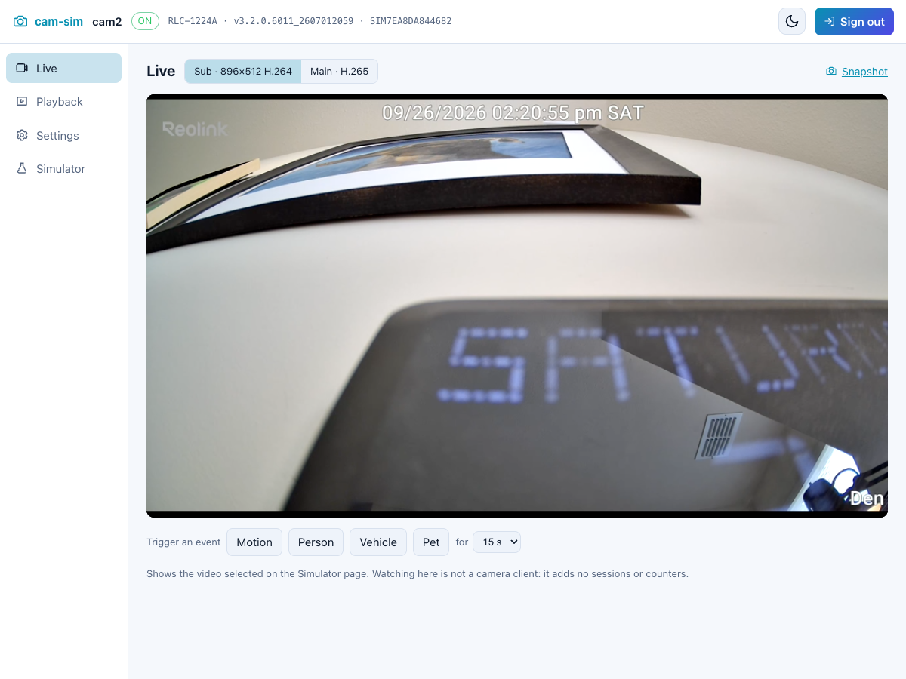
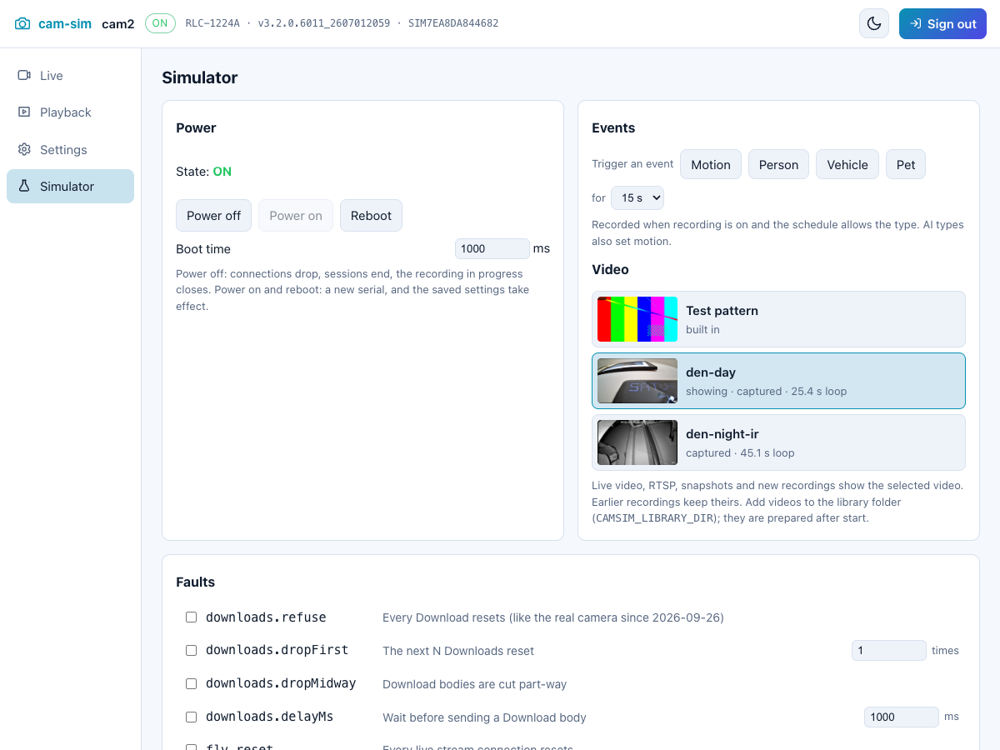

# cam-sim

cam-sim is a simulated **Reolink RLC-1224A** camera (firmware
v3.2.0.6011_2607012059). It speaks the camera's HTTP API, reproduces its
quirks, and can be made to fail in the ways the real device fails. It exists to
test software written against the camera, such as
[cams](https://github.com/klaushofrichter/cams) and
[cam-proxy](https://github.com/klaushofrichter/cam-proxy), the camera
gateway; both use cam-sim as a dev dependency pinned to a release tarball, in
CI and with several cameras at once.

Each simulator has two faces:

- **The simulated camera API** on the camera's ports. It answers like the real
  camera, so a client can't tell the difference.
- **The control API** on its own port, protected by a bearer token. It
  controls events, faults, power and state. Nothing on the camera ports can
  reach it.

One container is one camera. It runs headless by default; an optional
[web UI](#web-ui) shows the camera and the simulator's controls.

**Status:** released (latest v2026.09.27.3): the headless core (Plan 1), the
[video library](#video-library) (Plan 2), the [web UI](#web-ui) (Plan 3),
`cam2` in the cluster (Plan 4, see [below](#cam2-in-the-cluster)),
[RTSP](#rtsp) and [ONVIF](#onvif) events (Plan 5), and
[FTP upload](#ftp-upload) (Plan 6). Still open from the
[design spec](docs/superpowers/specs/2026-09-26-cam-sim-design.md): a curated
set of clips captured for the library, drawing the OSD on the video (see
[What differs](#what-differs-from-the-real-camera)), and recordings cut from
the video.
Without a library, pictures, live video and recordings are an ffmpeg
**test pattern**.

## Contents

- [Quick start](#quick-start)
- [Configuration](#configuration) · [Video library](#video-library)
- [Simulated camera API](#simulated-camera-api)
- [Control API](#control-api)
- [Web UI](#web-ui)
- [cam2 in the cluster](#cam2-in-the-cluster)
- [Secrets](#secrets)
- [Development](#development)

For LLMs and coding agents, [llms.txt](llms.txt) is a short summary of this
README, with links to its sections, the control API schema and the real
camera's measured behaviour.

## Quick start

**Docker, one camera:**

```sh
docker run --rm -p 8443:8443 -p 8080:8080 -p 9443:9443 -p 8554:8554 -p 8000:8000 \
  -e CAMSIM_USERS='admin:admin:<password>' -e CAMSIM_CONTROL_TOKEN='<token>' \
  -v cam-sim-data:/data ghcr.io/klaushofrichter/cam-sim:latest
```

The camera API is on 8443 (HTTPS) and 8080 (HTTP), the control API on 9443,
RTSP on 8554 and ONVIF on 8000. Point a client at the simulator the way it would reach a real camera: by
address, with the certificate checked against the camera's name.

**Docker, three cameras:** `docker compose up` in this repository starts
`cam2`, `cam3` and `cam4` on `127.0.0.1`; the ports are in `compose.yaml`. It
reads `CAMSIM_USERS` and `CAMSIM_CONTROL_TOKEN` from `.env`, and nothing else
from `.env` reaches the containers. Each mounts `./library` read-only as its
[video library](#video-library). Compose publishes the camera and control
ports only, not RTSP or ONVIF.

**Inside a test process** (Node), with no container:

```ts
import { createCamSim } from 'cam-sim';

const sim = await createCamSim({
  users: [{ name: 'u', level: 'admin', password: 'p' }],
  seedClips: 'demo',
});
// sim.cameraApp works with supertest; sim.listen() opens real ports.
sim.engine.faults.set({ name: 'downloads.refuse' });
await sim.close();
```

Install it from a release tarball, for example
`"cam-sim": "https://github.com/klaushofrichter/cam-sim/releases/download/v2026.09.27.3/cam-sim-v2026.09.27.3.tgz"`.
In a vitest `globalSetup`, call `ensureFixtures(defaultFixtureDir(), logger)` so
the test patterns are built once, not in every worker.

## Configuration

Everything is set with `CAMSIM_*` variables. For secrets, `<NAME>_FILE`
pointing at a mounted file wins over the plain variable.

| Variable | Default | Meaning |
|---|---|---|
| `CAMSIM_USERS` / `_FILE` | required | camera users, `name:level:password` separated by `;`, level `admin` or `guest` |
| `CAMSIM_CONTROL_TOKEN` / `_FILE` | — | bearer token for the control API. **Without it the control API is off** (404) |
| `CAMSIM_NAME` | `Cam` | camera name: `GetDevInfo.name` and the OSD name in `Osd.osdChannel.name` (stored, not drawn on the video) |
| `CAMSIM_TZ` | `America/Chicago` | camera time zone: `GetTime`, file names, Search times |
| `CAMSIM_SD_MB` | `4096` | simulated SD card size |
| `CAMSIM_SPEED` | `fast` | `real` adds the camera's timings: Login ~0.2 s, Search ~0.3 s, Download 150 KB/s, reboot 60 s, certificate restart 10 s. `fast` keeps the behaviour with short timings |
| `CAMSIM_SEED_CLIPS` | `none` | `demo`: start with six recordings, four today and two yesterday |
| `CAMSIM_AUTO_EVENTS` | `off` | background events, e.g. `motion:6/h,person:1/h` |
| `CAMSIM_FAULTS` | `[]` | faults switched on at start, as JSON, e.g. `[{"name":"downloads.refuse"}]` |
| `CAMSIM_FIRMWARE` | `v3.2.0.6011_2607012059` | the firmware version reported |
| `CAMSIM_SEED` | time | seed for serials and the reboot coin flip |
| `CAMSIM_DATA_DIR` | `/data` in the image | persistent settings, SD card index and certificates; unset means in memory |
| `CAMSIM_TLS_CERT_FILE` / `_KEY_FILE` | — | certificate at start; otherwise the one stored by `ImportCertificate`; otherwise a factory-style self-signed one (`CN=CERTIFICATE`) |
| `CAMSIM_HTTPS_PORT` | `8443` | camera HTTPS |
| `CAMSIM_HTTP_PORT` | `8080` | camera HTTP |
| `CAMSIM_CONTROL_PORT` | `9443` | control API |
| `CAMSIM_RTSP_PORT` | `8554` | [RTSP](#rtsp) (the camera's 554) |
| `CAMSIM_ONVIF_PORT` | `8000` | [ONVIF](#onvif), plain HTTP like the camera |
| `CAMSIM_MEDIAMTX` | `mediamtx` on the PATH, then `tools/mediamtx` | the MediaMTX binary that serves RTSP; the image includes it |
| `CAMSIM_WEB_UI` | `false` | `true` serves the [web UI](#web-ui) on the control port |
| `CAMSIM_CONTROL_TLS` | `auto` | `auto`: TLS on the control port only with `CAMSIM_TLS_CERT_FILE`; `on`: always, with the camera's current certificate, following `ImportCertificate`; `off` |
| `CAMSIM_FTP_SERVER`, `_PORT`, `_USER`, `_PASSWORD` / `_FILE`, `_DIR`, `_TLS`, `_STREAM` | — | [FTP upload](#ftp-upload) configured and switched on at start: port default 21, `_TLS` `true` (FTPS, the camera's default) or `false`, `_STREAM` `main` (default) or `sub` |
| `CAMSIM_FIXTURE_DIR` | temp dir | where the test-pattern media is built |
| `CAMSIM_LIBRARY_DIR` | — | a folder of videos to offer besides the test pattern (see [Video library](#video-library)) |
| `CAMSIM_VIDEO` | `test-pattern` | the library video to show once it is ready |
| `CAMSIM_MAIN_SIZE` | `4512x2512` | main-stream size of converted videos; smaller (e.g. `1280x720`) prepares much faster |
| `CAMSIM_MAX_VIDEO_S` | `60` | library sources are cut to this many seconds |
| `CAMSIM_LOG_LEVEL` | `info` | pino log level; logs never contain tokens, passwords or request URLs |

`CAMSIM_MEDIA=video` from the first design is refused; use the library.

### Video library

`CAMSIM_LIBRARY_DIR` holds the videos the camera can show besides the test
pattern. Each entry's id is its name in lowercase with dashes (`Garden
Walk.mp4` → `garden-walk`); long names are shortened with a hash, and a name
that collides (also with `test-pattern`) gets `-2`, `-3`, …:

- **Any video file** (`.mp4`, `.mov`, `.mkv`, `.m4v`, `.avi`, `.webm`) is
  converted to the camera's formats: main H.265 at `CAMSIM_MAIN_SIZE`, 20 fps;
  sub H.264 896×512, 10 fps; AAC 16 kHz (silent when the source has no sound).
  Keyframes as on the camera (its `GetEnc` gop): every 2 s on main, every 4 s
  on sub.
  The picture is scaled to fit, with bars.
- **A folder with `main.mp4` and `sub.mp4`** is a clip captured from the real
  camera. It is copied, not re-encoded, when main is H.265 and sub H.264;
  otherwise it is converted like any video. Copying also needs far less
  memory: converting a 4512×2512 source takes about 1 GB, so for a small
  container convert on a bigger machine and add the result as a pair.

After start the videos are prepared one at a time in the background, then
cached in `<CAMSIM_DATA_DIR>/library` (or the temp folder), one folder per
source version and settings, so instances can share it. Sources are cut to
`CAMSIM_MAX_VIDEO_S`. After a restart cached videos are ready at once, and a
removed source's cached copy still serves its recordings. A source changed
while the simulator runs is picked up at the next start. `GET /sim/api/videos` shows each one's state. Selecting a video
(`CAMSIM_VIDEO`, `PUT /sim/api/video`, or the web UI's Simulator page) switches
live FLV at once, RTSP within a second (readers reconnect), snapshots, and new
recordings. A recording keeps the video it was made from, so its size and
download stay the same.

Library videos are yours: the folder is mounted, never built into the image
or committed.

**Capturing from the real camera:** `scripts/capture-clip.py <name> <seconds>`
records main and sub over RTSP (no re-encode) into `library/<name>/`, with the
camera's OSD switched off for the capture and restored afterwards.
`--check` only signs in and reads the OSD. It uses `~/Development/reolink/.env`.

## Simulated camera API

This is the Reolink HTTP API as the real RLC-1224A answers it. The authority
is [cams' guide to the real camera](https://github.com/klaushofrichter/cams/blob/main/docs/reolink-api.md);
this section follows its structure and notes where the simulator differs.

The examples assume:

```sh
CAM=127.0.0.1:8443   # a simulator's HTTPS port
post() { local param=${2:-'{}'}; curl -sk -X POST "https://$CAM/cgi-bin/api.cgi?cmd=$1&token=$TOKEN" \
  -H 'Content-Type: application/json' -d "[{\"cmd\":\"$1\",\"action\":0,\"param\":$param}]"; }
```

### Basics

JSON commands are `POST /cgi-bin/api.cgi?cmd=<Cmd>&token=<token>` with a JSON
**array** body; the reply is an array in the same order.

```json
[{ "cmd": "GetDevInfo", "action": 0, "param": {} }]
```

```json
[{ "cmd": "GetDevInfo", "code": 0, "value": { "DevInfo": { "model": "RLC-1224A", "firmVer": "v3.2.0.6011_2607012059", "serial": "SIM3F0A…", "name": "Cam", "simulator": "cam-sim 2026.09.29.1", "…": "…" } } }]
```

`GetDevInfo` also answers `simulator: "cam-sim <version>"` (`cam-sim main` from a
`:main` image, `cam-sim dev` outside an image), the one field the real camera doesn't send, so clients (cams) can label the camera as simulated.

- **Every JSON reply is `Content-Type: text/html`**, as on the camera.
- On failure `code` is 1 and `error.rspCode` is negative:
  `[{"cmd":"Search","code":1,"error":{"detail":"the respode of msg is err","rspCode":-54}}]`.
- **Unknown commands** answer `[{"cmd":"Unknown","code":1,"error":{"detail":"not support","rspCode":-9}}]`.
- A body that isn't JSON answers `-4` ("param error"). Any `Content-Type` is accepted.
- A body with several entries is answered in one array.

### Ports and services

| Service | Container port | Camera port (`GetNetPort`) | Serves |
|---|---|---|---|
| HTTPS | 8443 | 443 | the whole API |
| HTTP | 8080 | 80 | the whole API |
| RTMP | — | 1935 | behind `/flv`, as on the camera |
| RTSP | 8554 | 554 | `h264Preview_01_main` / `_sub`, see [RTSP](#rtsp) |
| ONVIF | 8000 | 8000 | device and event services (PullPoint), see [ONVIF](#onvif) |

`GetNetPort` reports the camera's ports, not the container's. `SetNetPort`
switches services the way the camera does:

- `httpEnable: 0`: the HTTP port drops connections, and **Download** drops on
  HTTPS too (the camera needs HTTP for downloads).
- `httpsEnable: 0`: the HTTPS port drops connections.
- `rtmpEnable: 0`: `/flv` drops the connection.

### Login and tokens

```sh
TOKEN=$(curl -sk -X POST "https://$CAM/cgi-bin/api.cgi?cmd=Login" -H 'Content-Type: application/json' \
  -d '[{"cmd":"Login","action":0,"param":{"User":{"Version":"0","userName":"admin","password":"<password>"}}}]' \
  | jq -r '.[0].value.Token.name')
post Logout
```

- The reply carries only `value.Token`: `name` (16 hex characters) and
  `leaseTime: 3600` (seconds). A wrong user or password answers
  `{"detail":"login failed","rspCode":-7}`.
- Every other request carries `token=` in the query string; there is no header
  alternative.
- **Sessions accumulate** until their lease ends. `GetOnline` lists them:
  `{"User":[{"canbeDisconn":0,"ip":"…","level":"admin","sessionId":10,"userName":"admin"}]}`.
- A token ends with any of:
  - `Logout`, or the end of its lease;
  - a password change, or deletion of its user;
  - a reboot or a power cycle;
  - `CertificateClear`, or a successful `ImportCertificate`.

### Token rejection: four shapes

| Endpoint | Invalid or expired token |
|---|---|
| JSON commands (`POST`) | `code: 1`, `rspCode: -6`, detail "please login first" |
| `GET ?cmd=Snap` | **HTTP 200**, `text/html`, body `[{"code":1,"error":{"rspCode":-6,"detail":"please login first"}}]` |
| `GET /flv?…` | **no HTTP response**: the connection is reset |
| `GET ?cmd=Download` | **HTTP 401**, `text/html`, empty body |

### Commands

| Area | Command | `param` | `value` of the reply |
|---|---|---|---|
| Session | `Login` | `{User:{userName,password}}` | `{Token:{leaseTime,name}}` |
| | `Logout` | `{}` | `{rspCode:200}` |
| | `GetOnline` | `{}` | `{User:[…]}` |
| Users | `GetUser` | `{}` | `{CurUser:{User},User:[{level,userName}]}` |
| | `AddUser` | `{User:{userName,password,level}}` | `{rspCode:200}`; `-4` for a duplicate or invalid user |
| | `DelUser` | `{User:{userName}}` | `{rspCode:200}` |
| | `ModifyUser` | `{User:{userName,password?,level?}}` | `{rspCode:200}`; a new password ends that user's sessions |
| Device | `GetDevInfo` | `{}` | `{DevInfo:{model,firmVer,hardVer,serial,name,…}}`; the serial starts with `SIM` and changes at every boot |
| | `GetTime` | `{}` | `{Dst:{enable,offset,…},Time:{year,mon,day,hour,min,sec,isDst,timeZone,…}}`; `timeZone` is seconds **west** of UTC (Chicago: 21600) |
| | `GetHddInfo` | `{}` | `{HddInfo:[{capacity,size,mount,format,number,storageType}]}`; MB, **`size` is the free space** |
| | `GetEnc` | `{channel:0}` | `{Enc:{mainStream:{vType:"h265",size:"4512*2512",frameRate:20,…},subStream:{vType:"h264",size:"896*512",frameRate:10,…}}}` |
| | `GetNetPort` / `SetNetPort` | `{}` / `{NetPort:{…}}` | ports and `*Enable` flags |
| | `GetAbility` | `{User:{userName}}` | the camera's capability flags |
| | `Reboot` | `{}` | `{rspCode:200}`, **or the connection drops first** (half the time, seeded) |
| Recording | `GetRecV20` / `SetRecV20` | `{channel:0}` / `{Rec:{…}}` | `enable`, `postRec`, `preRec` (1: recordings start 4 s before the event), `saveDay`, `schedule.table` (168 characters per trigger type) |
| | `Search` | see [Search](#recordings-search) | `{SearchResult:{…}}` |
| | `CheckDownload` | `{filename}` | `{downloadTask:0\|1}`; `-4` for an unknown name |
| Detection | `GetMdAlarm` / `SetMdAlarm` | `{channel:0}` / `{MdAlarm:{…}}` | `newSens.sensDef` 1–50, **lower is more sensitive** |
| | `GetAiAlarm` / `SetAiAlarm` | `{channel:0,ai_type}` / `{AiAlarm:{…,ai_type}}` | per `people`, `vehicle`, `dog_cat`; `sensitivity` 0–100 |
| | `GetMdState` | `{channel:0}` | `{state:0\|1}`: 1 while an event is active |
| | `GetAiState` | `{channel:0}` | `{channel:0,people:{alarm_state,support},vehicle:{…},dog_cat:{…},face:{alarm_state:0,support:0}}` |
| Image and lights | `GetIsp` / `SetIsp` | `{channel:0}` / `{Isp:{…}}` | `dayNight` `Auto`, `Color`, `Black&White`; `rotation`, `mirroring`, … |
| | `GetIrLights` / `SetIrLights` | `{channel:0}` / `{IrLights:{state}}` | `Auto`, `Off`; the reply also carries `initial` and `range`, as on the camera |
| | `GetWhiteLed` / `SetWhiteLed` | `{channel:0}` / `{WhiteLed:{…}}` | `mode` 0–3, `bright` 0–100 |
| | `GetOsd` / `SetOsd` | `{channel:0}` / `{Osd:{…}}` | camera name (`osdChannel`), date and time (`osdTime`), Reolink logo (`watermark` 0/1); positions `Upper Left` … `Lower Right`; name ≤ 31 bytes. **Stored and validated only: nothing is drawn on the video** (see [What differs](#what-differs-from-the-real-camera)) |
| FTP | `GetFtpV20` / `SetFtpV20` | `{}` / `{Ftp:{…}}` | see [FTP upload](#ftp-upload); `server: ""` answers `-4` |
| | `TestFtp` | `{Ftp:{<the whole object>}}` | runs a whole session like the camera and stores a small `<Name>_00_<local time>.txt` in the login folder, saves no settings: `{rspCode:200}`; a partial object `-56` "err get data from json"; unreachable server or refused login `-454` "ftp connect failed" (both measured) |
| Certificates | `GetCertificateInfo` | `{}` | `{CertificateInfo:{crtName,enable,keyName}}`; `enable` is 1 once one is installed |
| | `CertificateClear` | `{}` | back to the factory certificate; sessions end; offline ~10 s (real speed) |
| | `ImportCertificate` | `{importCertificate:{crt:{size,name,content},key:{…}}}` | `content` is base64 PEM. **Importing over an installed certificate answers 200 and changes nothing**, as on the camera; clear first. A key that doesn't match answers `-4` |

Not supported, as on this firmware: `GetFtp` and `TestFtpV20` (`-9`). For now,
`CheckFirmware` (its reply isn't captured yet) also answers `-9`.

### Settings: always write the whole object

A `Set` answers `code 0, rspCode 200` for a partial object, and an immediate
re-read looks right. But **the keys you leave out are reset in the saved
configuration**, which takes effect at the next reboot or power-on (measured
on the real camera). Read the object, change your keys, and send the whole
object back.

Invalid values are rejected and the old value stays:
- `sensDef` outside 1–50, or `bright` outside 0–100: `-56`;
- an unknown `dayNight`, OSD position, IR state or `ai_type`: `-67`.

### Live video

```
GET /flv?port=1935&app=bcs&stream=channel0_<sub|main>.bcs&token=<t>
```

This is an endless `video/x-flv` response, paced in real time.

- **sub** is H.264 (codec id 7) + AAC.
- **main** is H.265 in FLV with the **legacy codec id 12**, the camera's
  vendor extension. mpegts.js 1.8+ plays it; ffmpeg can't read it.
- A viewer that stops reading is dropped instead of being buffered for.

### Snapshots

```sh
curl -sk "https://$CAM/cgi-bin/api.cgi?cmd=Snap&channel=0&rs=$RANDOM&token=$TOKEN" -o snap.jpg
```

The reply is `image/jpeg`. A bad token gets 200 `text/html` with the `-6` body.

### Recordings: Search

**Days with recordings in a month** (`onlyStatus: 1`):

```sh
post Search '{"Search":{"channel":0,"onlyStatus":1,"streamType":"main",
  "StartTime":{"year":2026,"mon":9,"day":1,"hour":0,"min":0,"sec":0},
  "EndTime":{"year":2026,"mon":9,"day":30,"hour":23,"min":59,"sec":59}}}'
# → {"SearchResult":{"channel":0,"Status":[{"year":2026,"mon":9,"table":"000000000000000000000000110000"}]}}
```

**Clips of one day** (`onlyStatus: 0`):

```json
{ "SearchResult": { "channel": 0, "File": [ {
  "name": "/mnt/sda/Mp4Record/2026-09-26/RecS0A_DST20260926_065221_065241_0_55148080000000_AAE60.mp4",
  "size": "700000", "type": "sub", "frameRate": 0, "width": 0, "height": 0,
  "StartTime": { "year": 2026, "mon": 9, "day": 26, "hour": 6, "min": 52, "sec": 21 },
  "EndTime":   { "year": 2026, "mon": 9, "day": 26, "hour": 6, "min": 52, "sec": 41 } } ] } }
```

- **One Search at a time, across the whole camera.** An overlapping Search
  answers `-54`, and the one already running comes back with no `File`.
- `size` is a string. A day without clips has **no `File` key**.
- A recording still in progress is listed with end `000000`.
- The main copy of a recording ends 2 s after the sub copy.
- A clip that crosses midnight is named by its start date, and its `EndTime`
  is on the next day.

### Recording file names

```
/mnt/sda/Mp4Record/2026-09-26/RecS0A_DST20260926_065221_065241_0_55148080000000_AAE60.mp4
```

The name is made of, in order:
- `RecS` for the sub stream, or `RecM` for main;
- the name version `0A`;
- `DST` when daylight saving time applies on that date;
- the date, the start and the end;
- `0`;
- 14 hex digits of flags;
- the size in hex.

Trigger bits are bit `55 − pos`: person 17, vehicle 19, pet 20, motion 24. AI
events also set the motion bit.

### Recordings: Download

```
GET /cgi-bin/api.cgi?cmd=Download&source=<full name>&output=<file>.mp4&token=<t>
```

The reply is `200 video/mp4` with a Content-Length: a fragmented MP4 that
starts with `ftyp mp42`. Its byte count differs from the Search `size`, as on
the camera.

- **Send `source` unencoded.** A percent-encoded path (`%2F`) resets the
  connection.
- **One Download at a time, across the whole camera**; a second one resets.
- `cmd=download` (lowercase) works. `cmd=Playback` answers 404.
- `user=…&password=…` instead of a token answers 404.
- A name that isn't on the card, including any `..` path, resets the
  connection.

### RTSP

`rtsp://<user>:<password>@<host>:8554/h264Preview_01_main` (H.265) and
`…/h264Preview_01_sub` (H.264): the camera's paths, including the `h264` in
the main path. They're served by [MediaMTX](https://github.com/bluenviron/mediamtx),
which the image includes; `scripts/install-mediamtx.sh` fetches it for local
development.

- **Sign-in:** a camera user (`CAMSIM_USERS`), Basic authentication, TCP
  transport.
- **Refused:** while `rtspEnable` is 0, while the camera is offline or powered
  off, or under the `rtsp.refuse` or `rtsp.reset` fault. Connected readers are
  cut when any of these starts except `rtsp.refuse`, and on reboot.
- **Port:** `CAMSIM_RTSP_PORT`; 0 picks a free port (in process), reported by
  `listen()`. MediaMTX needs a writable temporary folder.
- **Picture:** the selected video's clips, looped and copied, not re-encoded.
- **Without MediaMTX,** the simulator starts without RTSP and logs
  `rtsp_unavailable_no_mediamtx`.

### ONVIF

The camera's ONVIF device and event services on `CAMSIM_ONVIF_PORT` (8000),
plain HTTP, SOAP 1.2, as captured from the real camera (redacted replies in
[reference/rlc-1224a/onvif](reference/rlc-1224a/onvif)):

- **Sign-in:** WS-UsernameToken in every request except
  `GetSystemDateAndTime`, with the camera users.
  PasswordDigest and PasswordText both work, and `Created` must be within
  5 minutes. Otherwise the fault is `ter:NotAuthorized`.
- **Device service** (`/onvif/device_service`): `GetSystemDateAndTime`,
  `GetDeviceInformation`, `GetCapabilities`, `GetServices`.
- **Event service** (`/onvif/event_service`): `GetEventProperties` and
  `CreatePullPointSubscription`. A subscription answers with its manager
  address `/onvif/PullSubManager?Idx=<n>`, which takes `PullMessages` (a long
  poll: `Timeout`, default 5 s, at most 60 s), `Renew` and `Unsubscribe`. There are at most 16
  subscriptions; a subscription's lifetime defaults to 60 s when no
  `InitialTerminationTime` (or, on `Renew`, `TerminationTime`) is given, and is
  capped at 24 h either way.
- **Topics:**
  - `RuleEngine/CellMotionDetector/Motion` (`IsMotion`);
  - `MyRuleDetector/{FaceDetect, PeopleDetect, VehicleDetect,
    Non_Motor_VehicleDetect, DogCatDetect, Visitor, Package}` (`State`);
  - `VideoSource/MotionAlarm` (`State`).

  A new subscription first gets every topic as `Initialized`. Simulated
  events then send `Changed` at their start and end: motion drives both
  motion topics, person `PeopleDetect`, vehicle `VehicleDetect`, pet
  `DogCatDetect`.
- **Subscriptions live in memory,** as on the camera. Power-off, a reboot or
  switching ONVIF off ends them all, and waiting `PullMessages` connections
  drop, so a client has to subscribe again. A subscription keeps at most
  1000 unread messages (the oldest go first).
- **Refused** (the connection drops) while the camera is off or offline, or
  while `onvifEnable` is 0.
- **Limits:** request bodies up to 16 KB; 600 requests a minute per client
  address, then 429.

### FTP upload

Like the camera, the simulator is an FTP **client**. With `Ftp.enable: 1`
(set by `SetFtpV20` or `CAMSIM_FTP_*`), each finished recording whose triggers
the FTP schedule allows is uploaded:

- `<remoteDir>/YYYY/MM/DD/<Name>_00_YYYYMMDDHHMMSS.mp4`, with the start time in
  camera-local time and the date folders when `autoDir` is 1, plus a `.jpg`
  with the same name. No trigger information, as on the camera.
- The main-stream clip by default; `streamType: 1` sends the sub clip.
- FTPS (explicit TLS, certificate not verified) when `onlyFtps` is 1, the
  camera's default; plain FTP when 0.
- **The session follows the real camera's, measured against
  [cam-proxy](https://github.com/klaushofrichter/cam-proxy)'s server on
  2026-09-27:**
  - `AUTH TLS`, `USER`/`PASS`, `PWD`;
  - `CWD` into each folder, and `MKD` then `CWD` when it doesn't exist yet;
  - `TYPE I`, `MODE S`, `PBSZ 0`/`PROT P` with TLS;
  - `PASV` only (never EPSV), then `STOR`.

  The JPEG goes in a **second, parallel session** while the clip is still
  uploading.
- **Pre-record:** with `Rec.preRec` 1 (the default), a triggered recording,
  and so its file name, starts 4 s before the event, never before the previous
  recording ended.
- One recording at a time. A failure is logged and counted (`ftpFailures`), not
  retried. At most 20 wait; more are dropped and counted (`ftpDropped`).
- Each upload is reported on the SSE feed as an `ftp` event
  (`{file, ok, error?}`).
- Uploads already waiting continue through a power-off or reboot, and the
  recording that a power-off closes isn't uploaded. Neither is measured on the
  camera.
- The FTP password is stored in the data folder's settings file in plain text,
  as the camera keeps it in its configuration.

`ftp.fail` makes uploads and `TestFtp` fail (with `count`, only the next N);
`ftp.delayMs` delays uploads.

### What differs from the real camera

- **Pictures:** without a library they're a test pattern. The test pattern's
  main stream is 1280×720 (and a converted video's is `CAMSIM_MAIN_SIZE`),
  while `GetEnc` always reports 4512×2512.
- **Recordings:** an event during a recording extends it instead of starting
  an overlapping clip. (Pre-record, 4 s, is simulated.) A recording's file is
  always the fixed clip (the 12 s fixture, or the library loop) whatever the
  recording's own duration.
- **On-screen overlays (OSD):** the camera name, the date and time, and the
  Reolink logo (`watermark`) are settings only. `GetOsd`/`SetOsd` store,
  validate and return them, and they survive a restart, but cam-sim draws
  none of them. **Video is played as its source is**, in live video,
  snapshots and recordings alike:
  - the test pattern has no text on it;
  - library videos show whatever was in them when they were recorded. A clip
    recorded on the real camera with its OSD on shows that camera's name and
    the recording time (not the playing time), and its logo if it was on then.
    `scripts/capture-clip.py` switches the camera's OSD off for a capture for
    this reason.
- **Not measured on the real camera, so chosen:**
  - the error details for `-7` and `-67`;
  - the reset values of keys that were never measured;
  - Download's Content-Length;
  - the DST marker, taken per date rather than per instant.

## Control API

Base URL `http(s)://<host>:9443/sim/api`. Every request needs
`Authorization: Bearer <CAMSIM_CONTROL_TOKEN>`:

- a missing or wrong token answers 401 `{"error":"unauthorized"}`;
- a token in the URL (`?token=` or `?access_token=`) answers 400 `{"error":"token_in_url"}`;
- without a configured token, every route answers 404.

The full schema is in [openapi.yaml](openapi.yaml). It also lists the routes
the web UI uses (sign-in, media, recordings, settings, users). The UI signs in
with a session cookie instead of the bearer token; writes with the cookie need
the header `X-CamSim-UI: 1`, otherwise they answer 403 `{"error":"csrf"}`. Every
client may send 1200 requests a minute; more answer 429 `rate_limited`.

```sh
ctl() { curl -s -H "Authorization: Bearer $CAMSIM_CONTROL_TOKEN" -H 'Content-Type: application/json' "$@"; }
C=http://127.0.0.1:9443/sim/api
```

### State

`GET /sim/api/state`

```json
{
  "name": "Cam", "serial": "SIM3F0A…", "model": "RLC-1224A", "firmVer": "v3.2.0.6011_2607012059",
  "tz": "America/Chicago", "offline": false, "power": "on", "rebooting": false, "video": "test-pattern",
  "faults": [], "events": [],
  "sd": { "usedMb": 8, "capacityMb": 4096, "recordings": 6 },
  "counters": { "logins": 1, "loginAttempts": 1, "activeSessions": 1, "devInfoCalls": 0,
                "activeStreams": 0, "streamsOpened": 0, "downloads": 0, "activeDownloads": 0,
                "droppedDownloads": 0, "downloadOrder": [], "searches": 0, "setCalls": [], "reboots": 0,
                "ftpUploads": 0, "ftpFailures": 0, "ftpDropped": 0 },
  "certificate": { "source": "factory", "enable": 0 },
  "settings": { "Rec": { "…": "…" }, "Isp": { "…": "…" } }
}
```

- `power` is `on`, `off` or `booting`.
- `settings` are the running values.
- `downloadOrder` and `setCalls` keep the latest 1000 entries.

`GET /healthz` needs no token and answers `{"ok":true}`, for probes.

### Power and one-shot actions

`POST /sim/api/actions/<name>`

| Action | Body | Answer | Effect |
|---|---|---|---|
| `reboot` | `{"ms":1000,"dropsConnection":false}` (optional) | 202 | offline for `ms` (default: 1 s fast, 60 s real), then a new serial, no sessions, and the saved settings take effect. 409 `powered_off` while off |
| `power-off` | — | 204 | the camera goes dark: every connection drops, sessions end, the recording in progress is closed, background events pause, and new events are refused. 409 `already_off`, or `busy` while booting |
| `power-on` | `{"ms":1000}` (optional) | 202 | boots like a reboot (`power` is `booting`, then `on`), and background events resume. 409 `already_on` |
| `tokens.revoke` | — | 204 | every session ends |
| `flv.dropActive` | — | 204 | open live streams are cut |
| `downloads.dropActive` | — | 204 | downloads in flight are cut |
| `clear` | — | 204 | a known, empty content: recordings, the recent event list and counters are cleared; settings, the certificate and sessions stay |
| `factory-reset` | `{"ms":1000}` (optional) | 202 | the factory state: settings, faults, the video (test pattern), the certificate (the factory self-signed one) and the content are reset, waiting FTP uploads are dropped, then a reboot (sessions and ONVIF subscriptions end). 409 while off or booting |

```sh
ctl -X POST $C/actions/power-off
ctl -X POST $C/actions/power-on -d '{"ms":5000}'
ctl -X POST $C/actions/reboot -d '{"ms":2000,"dropsConnection":true}'
```

The camera's own `Reboot` command behaves like `reboot`, with the speed's
timing and a 50/50 chance of dropping the connection before it answers.

### Events

`POST /sim/api/events` with `{"type":"motion|person|vehicle|pet","durationS":1–3600}`
answers 201 `{event, recording}`.

- The event sets `GetMdState`, and `GetAiState` for AI types.
- It starts or extends a recording when `Rec.enable` is 1 and the schedule
  allows that type at that hour of the week. Otherwise `recording` is `null`.
- The recording ends `postRec` after the event.
- While the camera is off, the answer is 409 `powered_off`.

`GET /sim/api/events?limit=50` lists recent events, newest first.

```sh
ctl -X POST $C/events -d '{"type":"person","durationS":8}'
```

### Recordings

| Route | Body | Effect |
|---|---|---|
| `POST /sim/api/recordings/seed` | `{"clips":"demo"}` or `{"clips":[{"daysAgo":1,"start":"070000","end":"070030","triggers":["motion"],"mainEnd":"070032"}]}` | adds past recordings; 201 `{"added":n}` |
| `DELETE /sim/api/recordings` | — | empties the SD card; 204 |

### Faults

| Route | Effect |
|---|---|
| `GET /sim/api/faults` | the active faults |
| `PUT /sim/api/faults/<name>` | switches a fault on; the body holds its parameters; 200 with the fault |
| `DELETE /sim/api/faults/<name>` | switches it off; 204 |
| `DELETE /sim/api/faults` | switches all off; 204 |

A fault stays on until cleared, or, with `count`, applies only to the next N
matching requests.

| Fault | Parameters | Effect |
|---|---|---|
| `downloads.refuse` | | every Download resets (the real camera's state since 2026-09-26) |
| `downloads.dropFirst` | `count` | the next `count` Downloads reset |
| `downloads.dropMidway` | | Download bodies are cut part-way |
| `downloads.delayMs` | `ms` | wait before sending a Download body |
| `flv.reset` | | every `/flv` connection resets, even with a valid token |
| `flv.delayMs` | `ms` | delay the `/flv` response |
| `search.delayMs` | `ms` | make Search slower (widens the `-54` window) |
| `settings.fail` | `cmds`, `rspCode` (default -67) | those Set commands answer an error |
| `settings.ignore` | `cmds` | those Set commands answer 200 and change nothing |
| `settings.strictPartial` | | a partial Set's resets show at once, not after a reboot |
| `offline` | | every camera connection is destroyed (the camera stays powered) |
| `latencyMs` | `ms` | delay every camera request |
| `snap.fail` | | Snap answers 500 |
| `ftp.fail` | `count` optional | FTP uploads and `TestFtp` fail (`-454`) |
| `ftp.delayMs` | `ms` | wait before each FTP upload |
| `rtsp.refuse` | | RTSP refuses new readers; connected ones keep watching |
| `rtsp.reset` | | RTSP cuts connected readers and refuses new ones |

```sh
ctl -X PUT $C/faults/settings.fail -d '{"cmds":["SetWhiteLed"]}'
ctl -X PUT $C/faults/downloads.dropFirst -d '{"count":2}'
```

### Videos

- `GET /sim/api/videos` →
  `{"selected":"test-pattern","videos":[{"id":"test-pattern","name":"Test pattern","state":"ready","converted":true}, {"id":"garden-walk","name":"Garden Walk","state":"ready","converted":true,"durationS":12}]}`.
  `state` is `pending`, `preparing`, `ready` or `failed` (with `error`);
  `converted` is false for a captured pair.
- `PUT /sim/api/video` with `{"id":"garden-walk"}` → 200 `{"selected":"garden-walk"}`;
  404 for an unknown id, 409 while it isn't ready.
- `GET /sim/api/videos/{id}/poster` → a JPEG still of a ready video.

```sh
ctl $C/videos
ctl -X PUT $C/video -d '{"id":"garden-walk"}'
```

### Reset, request log, live feed

- `POST /sim/api/reset` with `{"settings":true,"recordings":true,"counters":true,"faults":true,"video":true}`
  answers 204 (`video` goes back to the test pattern). An empty body resets
  all five.
- `GET /sim/api/requests?limit=100` lists recent camera API requests: time,
  port, method, path **without the query**, command, status and duration.
  Tokens and passwords never appear.
- `GET /sim/api/stream` is Server-Sent Events: `state` (sent first, then on
  every change), `event`, `request`, `fault`, `ftp` and `video`, each with
  an `id:`.

### From the cams mock camera

| Mock option or call | cam-sim |
|---|---|
| `flvDelayMs` | `flv.delayMs` |
| `downloadDelayMs` | `downloads.delayMs` |
| `searchDelayMs` | `search.delayMs` |
| `dropFirstDownloads` | `downloads.dropFirst` with `count` |
| `settingsFailures` | `settings.fail` with `cmds` |
| `ignoreWrites` | `settings.ignore` with `cmds` |
| `rebootMs`, `rebootDropsConnection` | `createCamSim({ reboot: { ms, dropsConnection } })`, or the `reboot` action's parameters |
| `state.offline = true` | `offline` |
| `state.rejectAllStreams = true` | `flv.reset` |
| `state.revokeTokens()` | `tokens.revoke` |
| `state.dropStreams()` | `flv.dropActive` |
| `state.dropDownloads()` | `downloads.dropActive` |
| partial writes visible at once | `settings.strictPartial` |

## Web UI

With `CAMSIM_WEB_UI=true` the control port serves a web UI at `/`. Sign in by
pasting the control token once; it's exchanged for a session cookie
(HttpOnly, SameSite=Strict, 12 hours) and not stored in the browser. Signing
out, or a simulator restart, ends the session.

The UI has four pages:

- **Live:** the sub stream (H.264) or the main stream (H.265 in the camera's
  codec id 12 FLV), a snapshot, and buttons to trigger motion, person,
  vehicle or pet events.
- **Playback:** a month calendar with the days that have recordings, each
  day's recordings with their triggers, playback of the sub or main copy, and
  downloads.
- **Settings:** recording and schedules, detection sensitivities, image and
  lights, on-screen text (stored only, never drawn on the video) and network
  services. Each of these cards writes
  whole objects through the camera's own validation, so a rejected value
  shows the camera's error code. Device, storage, certificate and users are
  shown read-only (users change through the camera API). FTP has no card;
  set it with `PUT /sim/api/settings/Ftp`.
- **Simulator:**
  - power off, power on and reboot;
  - events;
  - the video library: pick the video the camera shows;
  - every fault, with its parameters;
  - actions and reset;
  - counters;
  - a live log of camera requests and events.





Looking at the UI is not a camera client: it creates no camera sessions and
changes no counters. A settings save in the UI writes the whole object, so the
saved and running values become equal. That also clears any reset a partial
camera-API write left waiting for the next reboot.

Each camera's session cookie carries its name (`camsim_session_<name>`, the
name lowercased with anything but letters and digits removed), so
several simulators on one host stay signed in side by side. Login attempts are
limited to 20 per 15 minutes per address, and the UI refuses to be shown
inside another page's frame.

To open it:

- **Local Docker:** `docker compose up` turns it on; open
  `http://127.0.0.1:9442/` for cam2.
- **Any simulator:** `scripts/cam-ui.sh [camera]` finds the camera in local
  Docker or the cluster, copies the token to the clipboard, and opens the
  browser.

The UI is built with Svelte 5 and Vite (`web/`, `npm run dev:web` against a
simulator on port 9443). It's tested by the Playwright specs in `e2e/`, which
run in Chrome.

## cam2 in the cluster

`cam2.skylar.technology` is a permanent simulator in the k3s cluster: namespace
`cam-sim`, Deployment and Service `cam2`, PVC `cam2-data`. kube-setup owns the
manifests.

- **How clients reach it:**
  - cams uses `cam2.cam-sim.svc.cluster.local:443`, with the TLS name
    `cam2.skylar.technology`;
  - the web UI and control API are at https://cam2.skylar.technology/ on the
    LAN only (Traefik; 403 from outside; the ACME challenge path stays open);
  - ONVIF `192.168.1.103:8000` and RTSP `192.168.1.103:554` are open to the
    LAN (Service `cam2-gateway`), in plain text like the camera, for
    cam-proxy;
  - the camera's HTTP(S) ports stay inside the cluster.
  - cam2 uploads its finished clips by FTP(S) to cam-proxy in the cluster
    (`cam-proxy.cam-proxy.svc.cluster.local:2121`, sub stream); the setting
    lives in cam2's persisted settings, set through cam-proxy's
    camera-ftp-setup, survives restarts, and a factory-reset clears it.
- **Video library:** PVC `cam2-library`, mounted read-only at `/library`
  (`CAMSIM_LIBRARY_DIR=/library`, `CAMSIM_MAIN_SIZE=1920x1080`). Videos go in
  through Deployment `cam2-library-loader`: scale it to 1, `kubectl cp` the
  files into its `/library/`, scale it back to 0, and restart cam2 (the
  library is read at start). Convert large sources on a bigger machine first
  (see [Video library](#video-library)).
- **Certificate:** a Let's Encrypt certificate, pushed daily at 04:27 by the
  `cam2-cert-push` CronJob, with the same script as cam1.
- **Settings:**
  - `CAMSIM_SPEED=real`, `CAMSIM_SEED_CLIPS=demo`;
  - background motion, person, vehicle and pet events;
  - `CAMSIM_CONTROL_TLS=on`, `CAMSIM_WEB_UI=true`.
- **Control API and web UI:** on the LAN at https://cam2.skylar.technology/
  (sign in with `CAMSIM_CONTROL_TOKEN`). From elsewhere,
  `scripts/cam-ui.sh [camera]` finds the camera in local Docker first, then in
  the cluster, where it port-forwards the control port to
  `https://127.0.0.1:9443/`. It copies the token to the clipboard and opens
  the web UI.
- **Deploys:** a release (merge to `production`) builds the image, pins it by
  digest in kube-setup's manifest, applies it through the in-cluster runner
  (`cam-sim-runner`), waits for the rollout and checks `/healthz`, and only
  then tags the release. Releases deploy automatically. cams and cam-proxy
  each pin a release tarball as a devDependency (now v2026.09.27.3) and need
  a bump PR after a release; `cams-compat` CI (below) covers cams only, not
  cam-proxy.

## Secrets

`.env` holds the values for deployments. It's mode 600 and never committed;
see `.env.example`. `scripts/sync-secrets.sh`:

- fills empty values and placeholders;
- sets the GitHub Actions secrets `CAMSIM_CONTROL_TOKEN`, `CAMSIM_USERS` and
  `KUBE_SETUP_DEPLOY_TOKEN` (from `GITHUB_KUBE_SETUP_PAT`; GitHub refuses
  `GITHUB_*` names);
- applies the Kubernetes Secrets `cam-sim-secrets` (the `CAMSIM_*` values)
  and `cam2-camera-credentials` (the admin user, for `cam2-cert-push`).

It prints key names only, and `--dry-run` shows what it would do. Options:
`--only github|kube`, `--rotate KEY` or `--rotate CAMSIM_USERS:<user>` (a new
password for one camera user), `--gh-login` (use your gh login instead of
`CAMSIM_GITHUB_PAT`), `--env-file PATH`.
`REOLINK_PASSWORD` and `CAMSIM_GITHUB_PAT` are never synced.

## Development

```sh
npm ci
npm test                 # vitest; needs ffmpeg for the fixtures
npm run build
scripts/container-smoke.sh
```

CI runs:
- the type checks and the tests;
- the Playwright e2e suite of the web UI;
- `npm audit` (blocking for production dependencies) and a check that no
  media file is committed;
- CodeQL, with the accepted exceptions in `.github/codeql-accepted.tsv`;
- the container smoke test;
- **cams' own unit and e2e suites against the cam-sim build**
  (`.github/workflows/cams-compat.yml`).

No camera footage is committed or published; the test patterns are
generated. The screenshots in `docs/screenshots/` are the exception, and show
a library video.

MIT licence.
